## 系统架构图
**描述：** 系统架构图展示了1Panel、Drone、Gitea和Docker-Compose等组件如何整合在一起，形成一个完整的开发-测试-发布-部署平台。1Panel作为服务器后台管理系统的核心，负责监控和维护服务器的运行状态。Drone作为CI/CD流程的自动化工具，负责构建、测试和部署代码。Gitea作为代码仓库管理，提供版本控制和团队协作功能。Docker-Compose作为部署方案，简化了多容器应用的部署和管理。

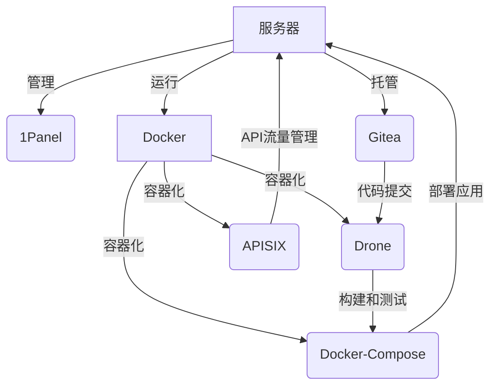

## 网络拓扑图
**描述：** 网络拓扑图描述了服务器、开发人员的工作站、代码仓库和部署环境之间的网络连接和数据流。开发人员通过工作站将代码提交到Gitea代码仓库，Drone检测到新的代码提交后，自动触发构建和部署流程。构建完成后，Docker-Compose将应用部署到服务器节点。

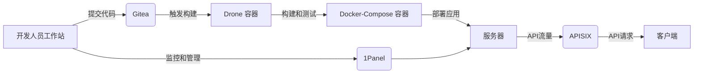

## 组件功能描述
**1Panel**

+ 管理服务器资源：监控CPU、内存和磁盘使用情况，优化资源分配。
+ 维护服务器：自动化更新和补丁管理，确保系统安全和稳定。

**Docker**

+ 容器化环境：提供容器化平台，支持Drone、Docker-Compose和APISIX的运行。

**Drone**

+ 自动化构建：代码提交后自动触发构建流程。
+ 测试集成：集成测试确保代码质量。
+ 部署自动化：一键部署到生产环境，减少人为错误。

**Docker-Compose**

+ 容器化部署：通过Docker容器化应用，提高部署的一致性和可移植性。
+ 快速启动：使用Docker-Compose快速启动和停止应用。
+ 环境一致性：确保开发、测试和生产环境的一致性。

**Gitea**

+ 版本控制：提供Git版本控制功能，支持团队协作。
+ 权限管理：灵活的权限设置，确保代码安全。
+ 分支管理：支持多分支开发，便于功能迭代和维护。

**APISIX**

+ API流量管理：作为API网关，管理入站和出站API流量。
+ 安全性：提供认证、授权和限流等安全功能。
+ 可扩展性：支持插件系统，可以根据需要扩展功能。

## 开发-测试-发布-部署流程图
**描述：** 开发-测试-发布-部署流程图展示了从代码提交到代码仓库，通过CI/CD流程构建和测试，然后发布，最后通过Docker-Compose部署到生产环境的整个流程。

**流程步骤：**

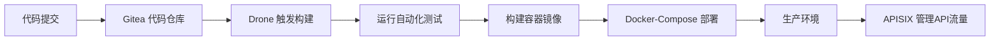

## 案例研究
**成功案例：**

+ **案例一：** 一家初创公司通过使用我们的平台，将产品从概念到上线的时间缩短了50%，显著提高了开发效率。
+ **案例二：** 一个中型互联网公司使用我们的平台后，部署效率提高了3倍，运维成本降低了40%，大大提升了企业的竞争力。

## 功能演示
#### 1Panel 服务器管理
监控CPU和内存使用情况  
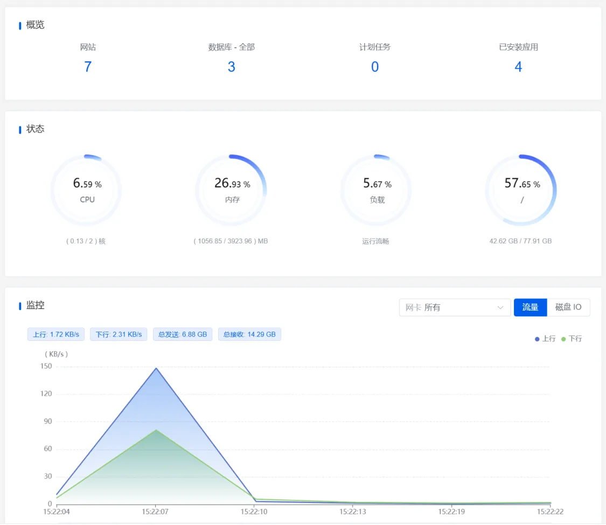  

#### Docker 容器化环境
Docker容器管理  
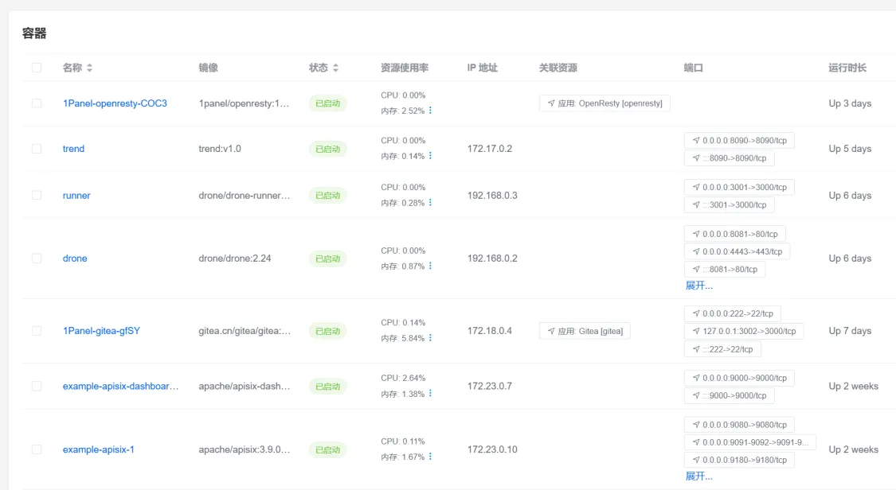

容器化应用部署&容器资源监控  
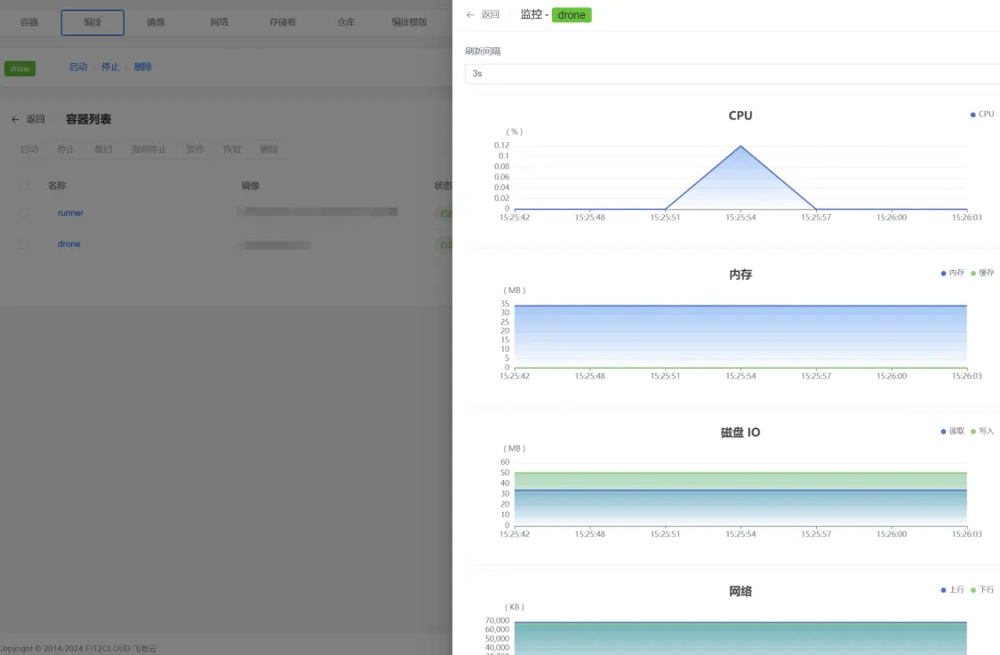

#### Drone CI/CD自动化
自动化后台  
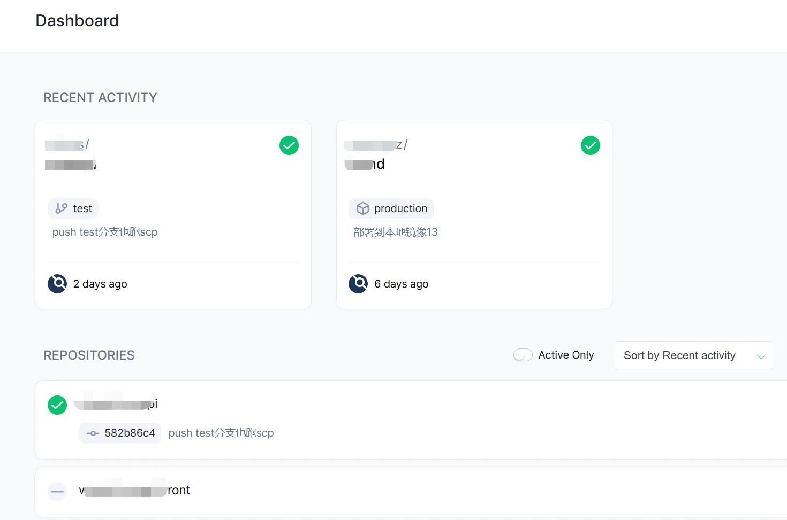

自动化部署监控  
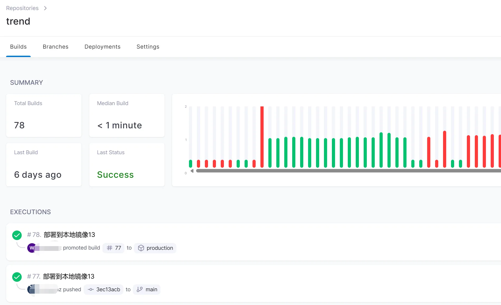

部署运行流程  
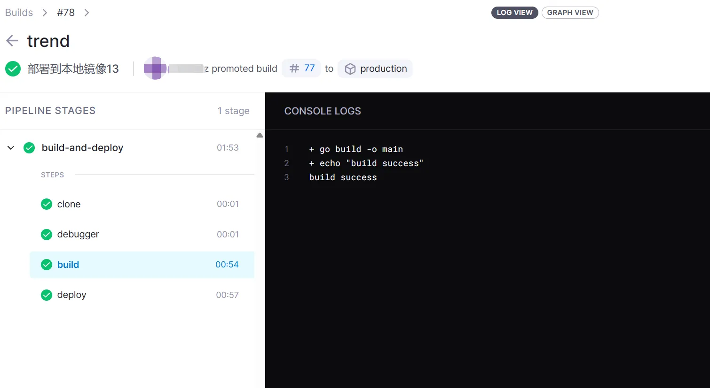

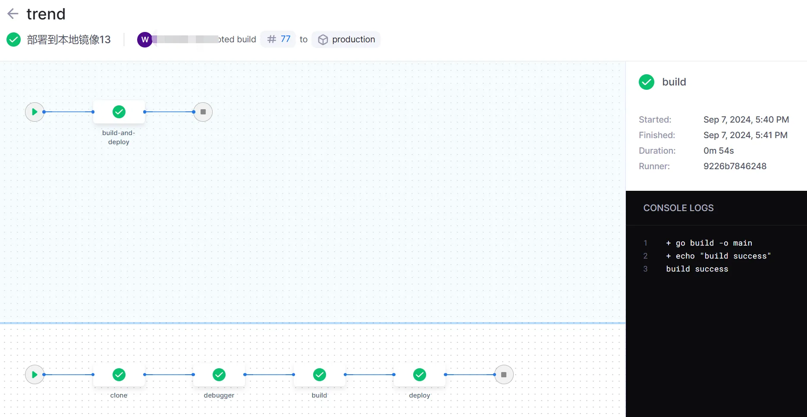

#### Gitea 代码仓库管理
代码版本控制  
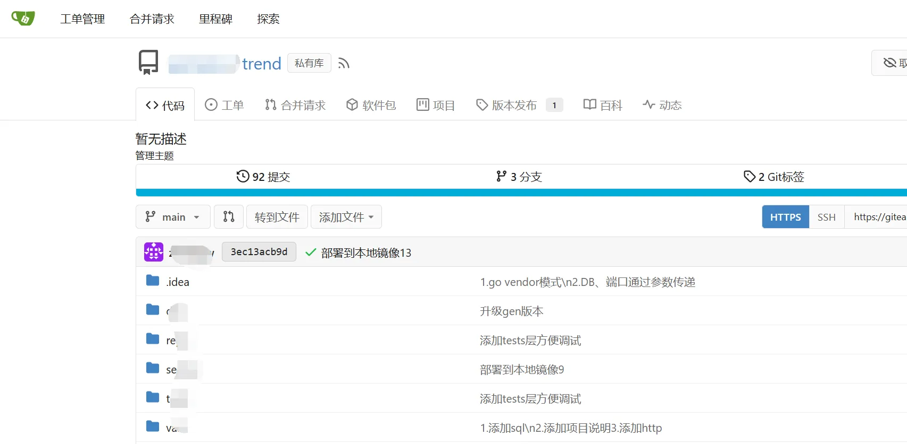

#### Docker 容器化部署
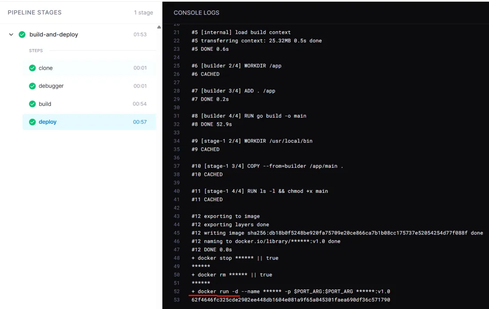

#### APISIX API网关
API流量管理  
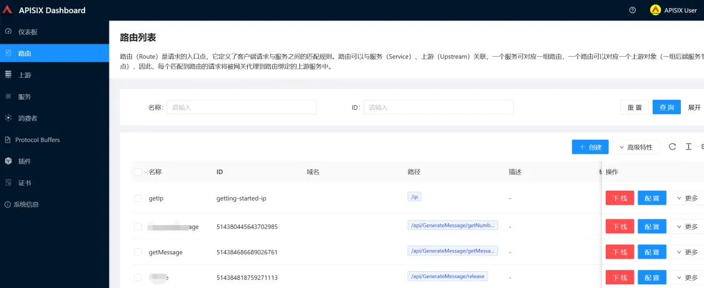

安全性和可扩展性  
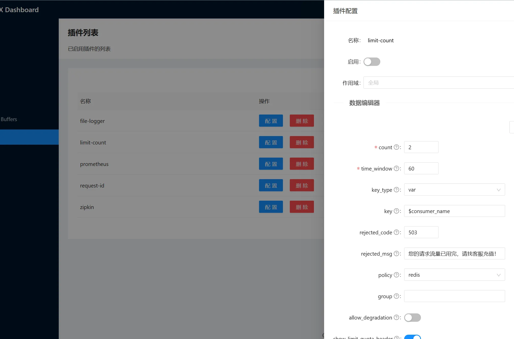

#### prometheus & grafana 监控apisix的指标
promthus 采集信息：

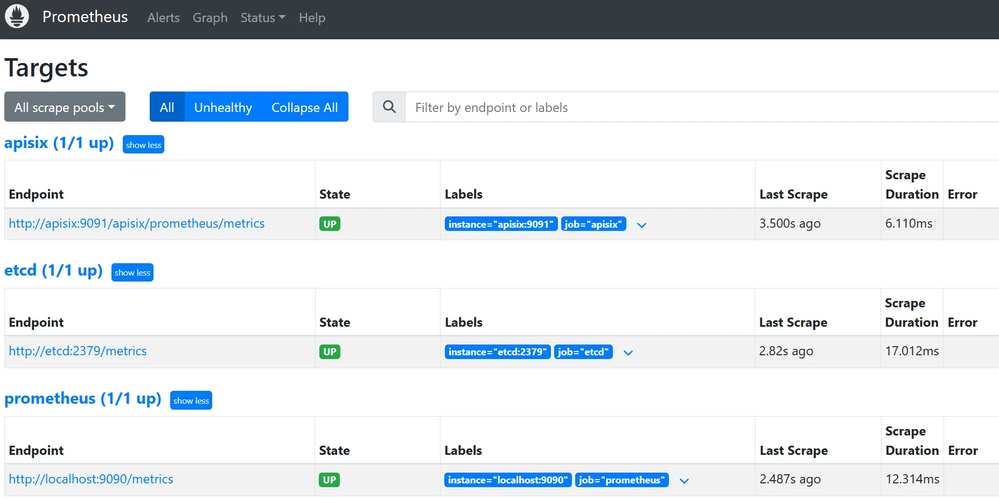

grafana 关注指标、监控告警

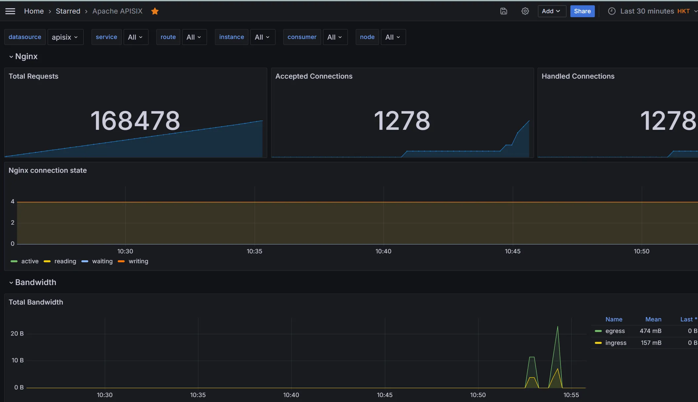

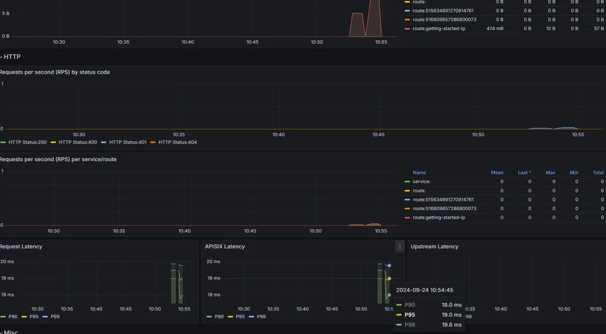

## 适用对象
**初创公司**：需要快速迭代产品，但可能缺乏足够的资源来构建和维护复杂的开发和部署流程。

**中小企业（SMBs）**：这些企业可能没有大型企业的资源，但需要灵活且可扩展的系统来支持他们的开发工作。

**微服务架构公司**：采用微服务架构的公司，需要一个能够支持多个独立服务部署和管理的系统。

**敏捷开发团队**：采用敏捷开发方法的团队，需要一个能够支持快速迭代和持续集成/持续部署（CI/CD）的系统。

**电子商务公司**：需要快速部署新功能和更新，以保持竞争力。

**移动应用开发公司**：需要频繁发布应用更新，需要一个自动化的部署流程。

**教育技术公司**：需要快速开发和部署教育工具和平台，以满足教育行业的需求。

## 联系方式

我们期待与您的合作，共同探索技术赋能的无限可能。如需了解更多信息或寻求合作，请通过以下方式联系我们：

- **电话**：13902907189
- **邮箱**：zhuchongbazhuli@gmail.com
- **地址**：深圳市宝安区新桥街道黄埔大塘路3号一楼

**深圳市光耀信达通讯科技有限公司**，与您携手共创美好未来。

[立即联系我们](mailto:zhuchongbazhuli@gmail.com)
